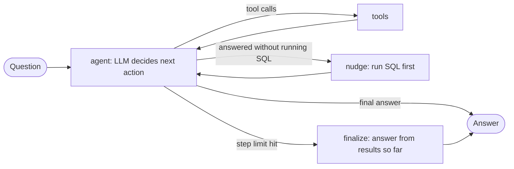

# Vendor Sales SQL Agent (LangGraph + Tool Calling)

A natural-language-to-SQL agent over a real vendor / inventory database (SQLite, 7 tables, 15.6M+ rows in the full version). Ask a question in English; the agent inspects the schema, writes SQL, runs it read-only, fixes its own errors, and answers from the actual query result.

## How it works



The LLM chooses which tool to call; LangGraph controls the loop, the step cap and the fallbacks.

| Tool | Purpose |
|---|---|
| `get_schema` | Tables, columns, row counts, plus notes on pitfalls (cached after the first call) |
| `describe_table` | 3 sample rows from one table, to see value/date formats |
| `run_sql` | One read-only `SELECT`; errors and empty results are returned to the model so it can fix the query |
| `calculate` | Arithmetic via a safe AST evaluator (no `eval`), so the model does not do math itself |

Structured outputs use Pydantic (`AgentResult`: answer, last SQL, steps, SQL calls, SQL errors, tools used, forced-stop flag).

## Safety

- Only a single `SELECT` / `WITH` statement is allowed (keyword + multi-statement check).
- The database is opened with `mode=ro`, so writes fail at the SQLite level even if the check is bypassed.
- Query timeout (60 s) and a 50-row cap on results sent back to the model.
- Hard step limit (8 LLM turns) and a finalize node, so the agent cannot loop forever.
- Temporary API errors (503 / 429 / timeouts) are retried with exponential backoff; other errors fail fast.

## Run it

```bash
python -m venv venv
venv\Scripts\activate            # Windows  (Linux/macOS: source venv/bin/activate)
pip install -r requirements.txt
cp .env.example .env             # then add your GOOGLE_API_KEY and model name

python agent_sql_v2.py "Which 5 vendors have the highest total freight cost?"
```

`agent_sql.py` is the first version (fixed pipeline: schema -> write SQL -> execute -> retry -> answer). `agent_sql_v2.py` is the tool-calling agent and reuses its database helpers.

### Demo database

The full database (~2 GB) is not in this repo. `sample_inventory.db` contains `final_summary`, `purchase_prices` and `vendor_invoice` in full, and evenly down-sampled copies of the four large tables. Totals computed from the sampled raw tables will not match the full dataset. To rebuild the sample from your own full `inventory.db`:

```bash
python make_sample_db.py
```

## Known failure modes (found while testing)

- **Plausible but wrong ranking.** For "top 5 brands by profit margin" the first version averaged the per-row ratio, which surfaced brands with a 100% margin (zero purchases in the period). The retry loop did not catch it because the SQL ran without error. Fix: schema notes and a prompt rule to prefer weighted ratios (`SUM(GrossProfit)/SUM(TotalSalesDollars)`) and exclude zero-volume rows.
- **No stopping condition.** The first tool-calling version kept issuing successful queries and hit the step cap (about 8 turns, over a minute per question). Added efficiency rules to the prompt, a trace mode to see each tool call, and a finalize node that forces an answer at the cap.
- **Join fan-out.** Joining `sales` to `purchases` at row level inflates totals (the same class of bug I found in the original analytics project). The schema notes tell the agent to aggregate each side in a subquery first.

## Evaluation

In progress. Plan: 30 questions with hand-verified gold SQL, comparing result sets (execution accuracy), with and without the retry/verification behaviour, and logging steps per question, forced-stop rate and latency (excluding API retry waits).

| Metric | Result |
|---|---|
| Execution accuracy | _to be filled after eval_ |
| Avg LLM steps per question | _to be filled after eval_ |
| Forced-stop rate | _to be filled after eval_ |

## Files

```
agent_sql.py        v1 pipeline + shared DB helpers (schema, safe run_sql)
agent_sql_v2.py     tool-calling LangGraph agent
make_sample_db.py   builds sample_inventory.db from the full database
requirements.txt
.env.example
```
